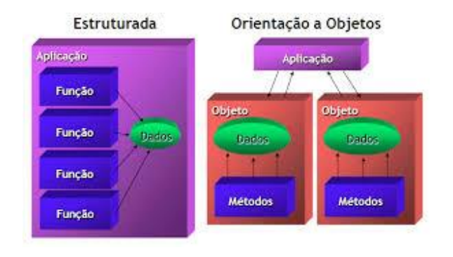
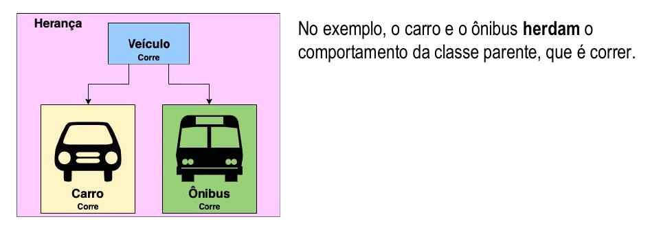

# Introdução de Paradigmas de Programação

## O que são Paradigmas?

→ Paradigma de programação é um meio de se classificar as
linguagens de programação baseado em suas funcionalidades.

→ As linguagens podem ser classificadas em vários paradigmas.

→ Um paradigma de programação fornece e determina a visão que
o programador possui sobre a estruturação e execução do programa.

## Quando usar um paradigma?

Um paradigma pode ser entendido como um tipo de estruturação ao qual a linguagem
deverá respeitar. A depender do objetivo proposto, a solução que a linguagem oferecerá
obedece a um tipo de paradigma.
Portanto, o que vai definir o paradigma utilizado será a tratativa dada ao problema.

→ Como você trata seus problemas?
→ Como você soluciona um problema de computação?

Isso envolve particularidades pessoais e de projeto.

### Exemplo de Situação

Imagine que você está em uma corrida de bike, seu maior objetivo é vencer a corrida, mas
como você vai conseguir alcançar o primeiro lugar no pódio?

→ Usar toda sua energia logo no começo?
→ Deixar uma grande capacidade de energia para o final da corrida?
→ Pegar vácuo de outros ciclistas para não sofrer tanto com a resistência do ar contra você;
→ Trapacear colocando tachinhas no caminho?

A forma de alcançar seu objetivo é seu paradigma !

## Por que aprender diferentes paradigmas?

Cada paradigma surgiu de necessidades diferentes. Dado isso,
cada um apresenta maiores vantagens sobre os outros dentro do
desenvolvimento de determinado sistema.

Sendo assim, um paradigma pode oferecer técnicas apropriadas
para uma aplicação específica. Escolhido o paradigma de
desenvolvimento adequado ao projeto, isso permitirá que sejam
desenvolvidas aplicações com grande produtividade.

Haverá unicidade na orientação de escrita do código entre a equipe,
tornando-o mais legível e criando facilidade de manutenção ao
longo de sua existência.

## Programação Orientada a Objetos

A POO é um paradigma de programação que se propõe a abordar o design de um sistema
em termos de entidades, os objetos, e relacionamentos entre essas entidades.

### Quais as vantagens de POO?

Herança: A herança permite um objeto estender outro objeto, herdando variáveis e métodos
da classe parente.

### Vamos ver mais um pouco...

Herança: A herança permite um objeto estender outro objeto, herdando variáveis e métodos
da classe parente.

